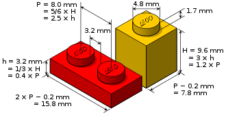

---

{height=80%}

# Was ist Interoperabilität?

---

\LARGE
Fähigkeit **unterschiedlicher Systeme**, möglichst reibungslos **zusammenzuarbeiten**

\normalsize
\vfill

* *Zusammenarbeiten*: sinnvoller Austausch von Daten

* *Möglichst reibungslos*: so gut es eben geht

# Wie lässt sich Interoperabilität herstellen?

## A: **Zentralisierung** statt Interoperabilität

Beispiel
 : Gemeinsamer Verbundkatalog

Vorteil
 : Klare Verantwortlichkeit

Probleme
 : Abgeschlossene Datensilos, interne Inkonsistenzen

## B: Integration durch **Mapping**

Beispiel
 : Konvertierung (Formate), coli-conc (Vokabulare)

Vorteil
 : Sehr flexibel

Problem
 : Aufwändig und fehleranfällig

## C: Gemeinsame **Standards**

Beispiel
 : Aggregator-Formate (Schema.org, DataCite XML...)

Vorteil
 : Offen für beliebig viele Akteure

Problem
 : Verschiedene Standards\
   für verschiedene Anwendungen

## Beispiel: Klemmbausteine

A) Zentralisierung:\
   Wir kaufen einfach alles nur von LEGO!

B) Mapping:\
   Adapter wie das Free Universal Construction Kit

C) Standards:\
   LEGO, Q-Bricks, BlueBrixx... passt doch zusammen!

\vfill

*Meist wackelt es trotzdem ein bisschen...*

## Besonderheit bei Interoperabilität von Daten

Wau Holland (1951-2001):

> Der Computer ist eine Maschine zum Kopieren und Verändern von Bits.

\vfill

* Daten lassen sich verlustfrei kopieren und ändern
* Automatisierung: einmal, zweimal, $\infty$...
* Es gibt keine größeren Daten-Einheiten\
  (Datensätze, Felder, Sammlungen...)

## Interoperabilität von Daten herstellen

A) Zentralisierung:\
  Keine Gesamtlösung aber hilfreich zur Abgrenzung von Systemen

B) Mapping:\
  Findet als Konvertierung an vielen Stellen statt

C) Standards:\
  Grundlage der gesamten Infrastruktur

## Metadaten-Interoperabilität in der Theorie

Interoperabilität
 : Fähigkeit unterschiedlicher Systeme, reibungslos Daten auszutauschen

Informationssystem
 : quasi-geschlossene Einheit, die standardisierte Daten austauscht

Mapping
 : Konvertierung von Daten von einem Standard in einen anderen

## Metadaten-Interoperabilität in der Praxis

Probleme:

* Es gibt sehr viele Standards und Informationssysteme

* Standards sind meist unvollständig

* Mappings sind meist unvollständig

Lösung:

* Kenntnis von Metadaten-Standards und Mapping-Verfahren

# Metadaten-Standards und Mapping-Verfahren

## Standards 1

{width=90%}

## Standards 2-15

](standards.png){width=95%}

## Metadaten-Standards

* **Vereinbarungen** wie Daten aussehen sollen

* **Explizite** Vereinbarungen wie Daten aussehen sollen

    * Publiziert und verständlich, mit Beispielen
    * Versioniert (was ist seit wann wie geregelt?)
    * Maschinenlesbar

* **Aufbauend** auf bereits etablierten Standards

    * Anwendungsbezogen
    * Möglichst in verschiedenen Systemen umgesetzt

* **Überprüfbar**

    * Validierung von Daten (Fehler erkennen)
    * Konsequente (mit Fehlern umgehen)
    * Fehler $\neq$ Fehler

## Beispiel: Ebenen von Metadaten-Standards in der Praxis

* Lokale Anwendungspraxis einer Bibliothek
* PICA-K10plus-Format
* PICA-Format
* PICA/XML
* XML
* Unicode
* Bytes

## Arten von Daten-Standards und -formaten

...

# Daten-Mapping/Konvertierung

## Was kann gemappt bzw. konvertiert werden?

* Inhalte
    * z.B. YYYY-MM-
    * z.B. Jakob Voß $rightarrow$ 

* Vokabulare

* Formate

Zwei Arten des Mappings von Daten

Mappings zwischen Inhalten

Vokabularen

* Normdaten-IDs: ein beispiel personen-ID
* Ein Beispiel Themen z.B. GND < DDC

Mapping zwischen Formaten

* Autor: Vorname Nachname
* Hauptautor: Nachname, Vorname

## Unterscheidung

Mapping von Formaten: Konvertierung, Auswahl

Mapping von Normdaten: Projekt coli-conc

...

# Zusammenfassung

## ...

...

## Weiterführendes

* [GBV Formatdatenbank format.gbv.de](https://format.gbv.de/)

* [Grundlagen Datenformate](https://pro4bib.github.io/pica/#/grundlagen?id=datenformate) im Handbuch *Einführung in die Verarbeitung von PICA-Daten*

* *Anleitung für schlechte Standards* <https://doi.org/10.5281/zenodo.1025743> und <https://youtu.be/o51FOLsh4Ec>

* [Kompetenzzentrum Interoperable Metadaten (KIM)](https://dini.de/ag/kim/)

* [Projekt coli-conc](https://coli-conc.gbv.de/)
